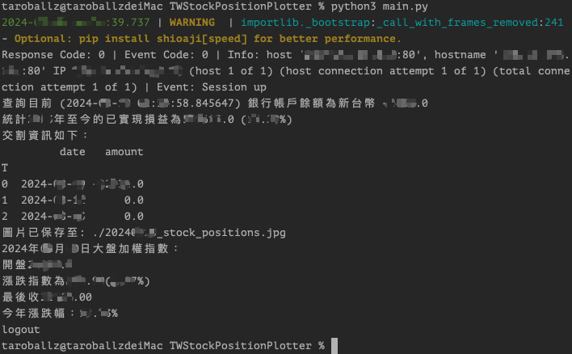
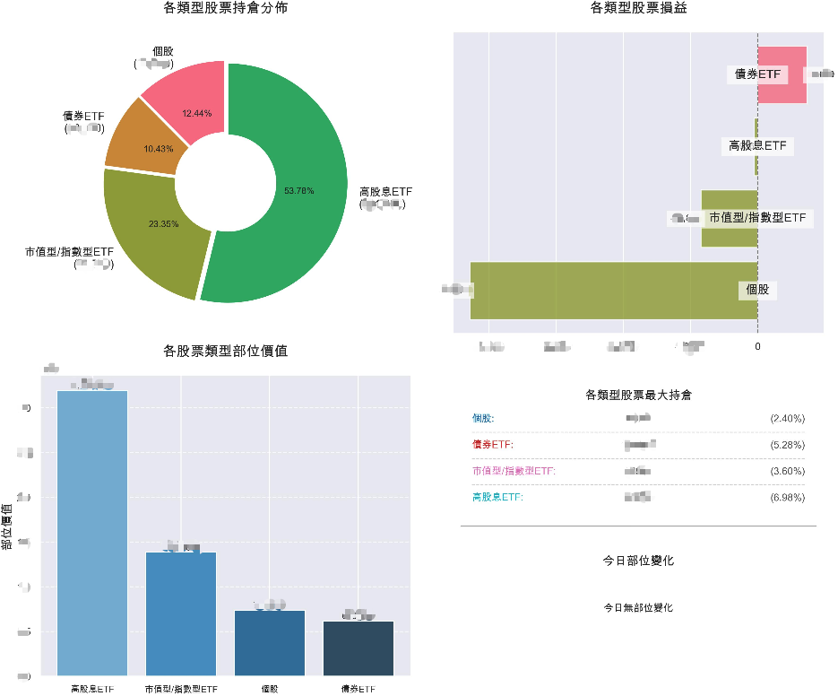

# TWStockPositionPlotter
台股持倉資訊暨股票類型分類繪圖專案，透過證券商(永豐金Shioaji)提供的持股資訊，繪製出各股票類型的持股比例圖，並可匯出持股、部位變化及帳務資訊。
- 各股票類型分類及台股大盤指數來源：[StockQ.org](https://www.stockq.org/)
- 證券商API來源：[永豐金證券Shioaji](https://sinotrade.github.io/zh_TW/)

## 環境需求
- Python 3.9+

## 使用方式
### 本地端執行
1. 安裝相關套件
   ```bash
   pip3 install -r requirements.txt
   ```
2. 修改`.env`檔案
   - 修改`.env`檔案中`SHIOAJI_API_KEY`,`SHIOAJI_SECRET_KEY`為自己的**永豐金證券**API金鑰。
   - 修改`.env`檔案中`PRIVATE_OUTPUT_DIR`為自己詳細持股輸出之資料夾，預設為當前資料夾。
   - 修改`.env`檔案中`PUBLIC_OUTPUT_DIR`為繪製出各股票類型的持股比例圖輸出資料夾，預設為當前資料夾。
3. 執行程式
   ```bash
   python3 main.py
   ```
   - 可根據自己的需求，修改`main.py`中各種調用的函數，以達到自己的需求。

### Docker執行
待更新...


## 執行效果
- 終端輸出顯示帳務及當日大盤指數資訊
  - 
- 輸出各股票類型持股比例圖
  - 